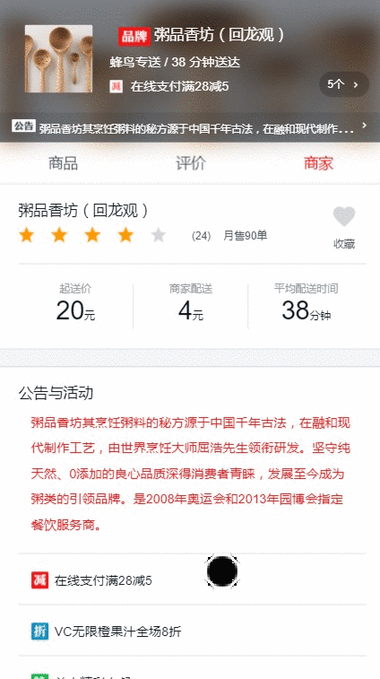

# vue-elm app

<p align="center">
  
  
</p>

<p align="center">
  
  
</p>

# Libraries

技术栈

- vue（^2.5.2）
- vue-router（^3.0.1）：vue 官方的路由插件
- vux (2.9.2) : vue的移动端组件库
- better-scroll (1.13.2) 解决移动端各种滚动场景需求的插件
- axios (0.18.0) 是一个基于promise 的HTTP 库
- express：node.js 的 web 开发框架
- less：css 预处理器

# Feature

特点

- vue 2.0 + express + less
- 数据 mock
- 移动端高清适配

# Build Setup

```sh
# install dependencies
npm install

# serve with hot reload at localhost:8080
npm run dev

# build for production with minification
npm run build
```

# 移动端高清适配

```css
  body,html{
    font-size: 13.3333333333333vw; 
  }
```

# 适配思路：
```
  750px/7.5 = 100px
  100vw/7.5 = 13.3333333333333333333333vw 
  100px = 13.3333333333333333333333vw 
  13.3333333333333333333333vw = 1rem
  100vw = 750px
  1vw = 7.5px
  100px = 1rem 
  90px = 0.9rem =  13.3333333333333333333333 x 0.9 x 7.5
```

### 举例：
设计稿为750px下宽度为240的图片在各种DPR设备下的实际尺寸：
```js
  iPhone4 ：
          DPR=2， device-width=320 
        picWidth = (240*(320*2/750))/2
  iPhone6 ：
          DPR=2， device-width=375 
          picWidth = (240*(375*2/750))/2
  iPhoneX ：
          DPR=3， device-width=375 
          picWidth = (240*(375*3/750))/3
  Pixel 2 XL：
          DPR=3.5， device-width=411 
          picWidth = (240*(411*3.5/750))/3.5
```

### 部分适配代码：

### 设置小球动画时候小球的位置：
```js
  beforeDrop(el) {
    let count = this.balls.length;
    while (count--) {
      let ball = this.balls[count];
      if (ball.show) {
        let dpi = window.devicePixelRatio;
        let screenWidth = window.screen.width;
        let pixel = dpi*screenWidth;
        let rect = ball.el.getBoundingClientRect();
        let left = (82*(pixel/750))/dpi;
        let bottom = (58*(pixel/750))/dpi;
        let x = rect.left + (rect.width/2) -left;
        let y = -(window.innerHeight - rect.top - (rect.height/2) - bottom);
        el.style.display = 'block';
        el.style.webkitTransform = `translate3d(0,${y}px,0)`;
        el.style.transform = `translate3d(0,${y}px,0)`;
        let inner = el.getElementsByClassName('inner-hook')[0];
        inner.style.webkitTransform = `translate3d(${x}px,0,0)`;
        inner.style.transform = `translate3d(${x}px,0,0)`;
      }
    }
  }
```

### 设置better-scroll横向滚动时的content宽度：
```js
  initPics() {
    if (this.seller.pics) {
      let dpi = window.devicePixelRatio;
      let screenWidth = window.screen.width;
      let pixel = dpi*screenWidth;
      let picWidth = Math.ceil((240*(pixel/750))/dpi);
      let margin = (12*(pixel/750))/dpi;
      let width = (picWidth + margin) * this.seller.pics.length - margin;
      this.$refs.picList.style.width = width + 'px';
      this.$nextTick(() ={
        if (!this.picScroll) {
          this.picScroll = new BScroll(this.$refs.picWrapper, {
            scrollX: true,
            eventPassthrough: 'vertical'
          });
        } else {
          this.picScroll.refresh();
        }
      });
    }
  }
```


# API

数据 mock

- 采用了easymock (http://easy-mock.com/)
- 新建项目
- 上传数据
- 配置接口

```js
  import axios from "axios"

  axios.defaults.baseURL = 'https://easy-mock.com/mock/5baba5e600c17a2d8a77f59c'

  export function getGoods(){
      return axios.get('/goods')
  }
  export function getRatings(){
      return axios.get('/ratings')
  }
  export function getSeller(){
      return axios.get('/seller')
  }
```

# 项目功能
- [x] 商品页面
- [x] 详情页面
- [x] 评价页面
- [x] 商家页面
- [x] 商品添加
- [x] 购物车
- [x] 购买动画
- [x] 商品评价切换
- [x] 点赞

>后续功能待测试继续改进


# Thanks

- [ustbhuangyi](http://coding.imooc.com/class/74.html)
